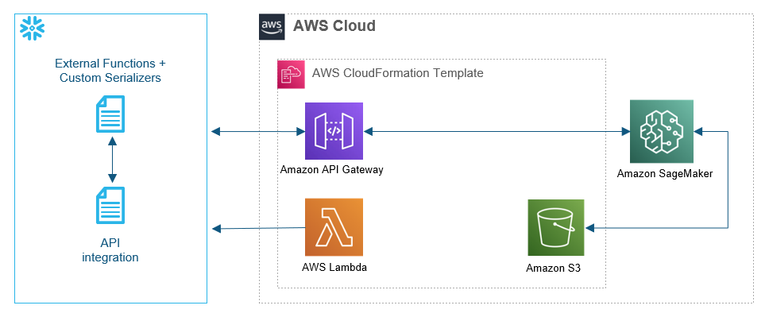

:xrefstyle: short

Deploying this Quick Start with default parameters builds the following {partner-product-short-name} environment in the AWS Cloud.

// Replace this example diagram with your own. Follow our wiki guidelines: https://w.amazon.com/bin/view/AWS_Quick_Starts/Process_for_PSAs/#HPrepareyourarchitecturediagram. Upload your source PowerPoint file to the GitHub {deployment name}/docs/images/ directory in this repo. 

[#architecture1]
.Quick Start architecture for {partner-product-short-name} on AWS

As shown in <<architecture1>>, the Quick Start sets up the following:

* An Amazon API Gateway to integrate your AWS account with your Snowflake account.
* An Amazon S3 bucket to store assets.
* An AWS Lambda function to set up integration with your Snowflake database.
